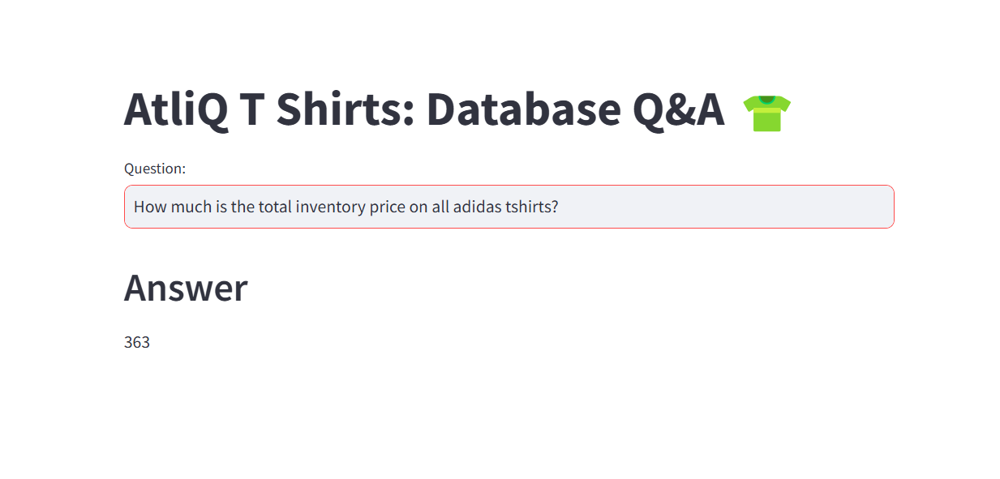

# AtliQ T-Shirts Inventory Query System 👕

## Project Overview
This project enables users to ask natural language questions about **AtliQ T-Shirts' inventory**, and it converts those questions into **MySQL queries** using **Google Gemini Pro**. The system fetches relevant data from **MySQL Workbench** and provides answers based on real-time inventory information.

## Features
- 🧠 **Natural Language Processing**: Uses **Gemini Pro** to process user queries.
- 🔍 **Automated SQL Query Generation**: Translates simple questions into SQL queries.
- 🗃️ **MySQL Database Integration**: Connects to the AtliQ T-Shirts database.
- 🎯 **Few-Shot Learning**: Utilizes **few-shot examples** to improve SQL query accuracy.
- 🌐 **Web Interface**: Powered by **Streamlit** for user interaction.

---

## 🛠 Technologies Used
- **Python**
- **LangChain**
- **Google Generative AI (Gemini Pro)**
- **MySQL**
- **Streamlit**
- **HuggingFace Embeddings**
- **ChromaDB**

---

## 📌 Installation & Setup

### Prerequisites
- Python 3.8+
- MySQL installed and running
- A **Google API key** for Gemini Pro
- Necessary Python dependencies

### Steps
1. **Clone the repository:**
   ```sh
   git clone https://github.com/your-repo-name.git
   cd atliq-tshirts-inventory
   ```

2. **Install dependencies:**
   ```sh
   pip install -r requirements.txt
   ```

3. **Set up environment variables:**
   - Create a `.env` file and add:
     ```ini
     GOOGLE_API_KEY=your_google_api_key
     ```

4. **Configure MySQL database connection:**
   - Update the following details in `get_few_shot_db_chain()`:
     ```python
     db_user = "your_username"
     db_password = "your_password"
     db_host = "localhost"
     db_name = "atliq_tshirts"
     ```

5. **Run the application:**
   ```sh
   streamlit run app.py
   ```

---

## 🚀 Usage
1. Open the **Streamlit app**.
2. Enter a question, for example:
   ```
   How many Levi's T-shirts are in stock?
   ```
3. The system generates an **SQL query** and fetches the data from MySQL.
4. The answer is displayed on the screen.

---

## 📊 Example Query & Response

### **Input Question**
```
If we have to sell all the Levi’s T-shirts today with discounts applied, how much revenue will be generated?
```

### **Generated SQL Query**
```sql
SELECT SUM(price * stock_quantity * (1 - discount/100)) AS total_revenue
FROM inventory
WHERE brand = 'Levi’s';
```

### **Output**
```
Total revenue after discount: $XX,XXX
```

---

## 📸 Screenshots


---

## 🔮 Future Enhancements
- 🎙 **Voice-based input**  
- 📈 **Data visualization for better insights**  
- 📊 **Integration with external analytics tools**  

---

## 📝 License
This project is licensed under the **MIT License**. Feel free to modify and enhance! 🚀

---

### 📩 Contact  
For any issues, reach out at **your-email@example.com**.
```

This **Markdown file** is properly formatted for GitHub with **headings, code blocks, emojis, and sections** for easy readability. Just **copy and paste** this into `README.md` in your GitHub repo. 🚀
